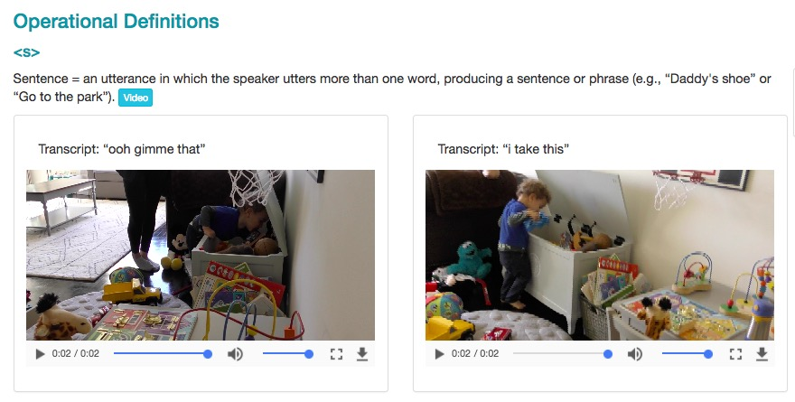

```{r setup, include=FALSE}
knitr::opts_chunk$set(echo = FALSE)
```

<div class="centered">


</br>

</br>

</div>

# Agenda

## Video as data

## Video as documentation

## Open video sharing with Databrary

## Video analysis with Datavyu

## The future of video sharing

# Video as data

---

<video width="800" controls>
  <source src="https://nyu.databrary.org/slot/27087/0,372193/asset/119877/download?inline=true#t0,45" type="video/mp4">
Your browser does not support the video tag.
</video>

Adolph, K., Tamis-LeMonda, C. & Gilmore, R.O. (2017). PLAY Project: Pilot Data Collections. Databrary. Retrieved April 24, 2018 from https://nyu.databrary.org/volume/444.

## Video...

## Captures the complexities and nuances of behavior unlike any other measure

## Can be readily repurposed to answer new questions

## Contains faces & voices that make it hard(er) to share openly

## Involves large file sizes that pose challenges to storage & streaming

# Video as documentation

---

<video width="800" controls>
  <source src="https://nyu.databrary.org/slot/14765/0,79273/asset/64898/download?inline=true" type="video/mp4">
Your browser does not support the video tag.
</video>

The PLAY Project Wiki: <https://dev1.ed-projects.nyu.edu/wikis/docuwiki/doku.php/landing>

---

<video width="800" controls>
  <source src="https://nyu.databrary.org/slot/16668/0,140984/asset/72645/download?inline=true" type="video/mp4">
Your browser does not support the video tag.
</video>

Bahrick, L.E. (2017). Multisensory Attention Assessment Protocol (MAAP). Databrary. http://doi.org/10.17910/B7.326.

---

<video width="800" controls>
  <source src="https://nyu.databrary.org/slot/9809/-/asset/11354/download?inline=true" type="video/mp4">
Your browser does not support the video tag.
</video>

Naigles, L. (2014). Children use syntax to learn verb meanings. Databrary. http://doi.org/10.17910/B7J01M.

---


<audio controls>
  <source src="https://nyu.databrary.org/slot/12213/0,15046/asset/46757/download?inline=true" type="audio/mpeg">
Your browser does not support the audio element.
</audio>
<audio controls>
  <source src="https://nyu.databrary.org/slot/12212/0,15046/asset/46748/download?inline=true" type="audio/mpeg">
Your browser does not support the audio element.
</audio>

Cole, P.M., Gilmore, R.O., Scherf, K.S. & Perez-Edgar, K. (2016). The Proximal Emotional Environment Project (PEEP). Databrary. http://doi.org/10.17910/B7.248.

## Video (& audio)...

## Reveals critical procedural details that text-based descriptions omit

## Captures the complexities and nuances of *experimenter* behavior unlike any other measure

## Is a "gold-standard" in documenting procedures, displays, & materials

## Can document annotation/code definitions

---

<a href="https://dev1.ed-projects.nyu.edu/wikis/docuwiki/doku.php/manual2#operational_definitions">

</a>

The PLAY Project Wiki: <https://dev1.ed-projects.nyu.edu/wikis/docuwiki/doku.php/landing>

---

<video width="800" controls>
  <source src="https://nyu.databrary.org/slot/14765/-/asset/63348/download?inline=true" type="video/mp4">
Your browser does not support the video tag.
</video>

The PLAY Project Wiki: <https://dev1.ed-projects.nyu.edu/wikis/docuwiki/doku.php/landing>

---

<a href="http://www.apa.org/science/about/psa/2017/10/video-data.aspx">

</a>

Adolph, K.E., Gilmore, R.O., & Kennedy, J.L. (2017, October). Video data and documentation will improve psychological science. *Psychological Science Agenda*.

<!-- --- -->

<!-- <a href="http://doi.org/doi:10.1038/s41562-017-0128"> -->
<!--  -->
<!-- </a> -->

<!-- Gilmore, R.O. & Adolph, K.E. (2017). Video can make behavioural science more reproducible. *Nature Human Behaviour*. -->

# Open video sharing

---

<a href="http://databrary.org">

</a>

[Databrary.org](http://databrary.org)

---

<video width="800" autoplay loop>
  <source src="mov/databrary-splash.mp4" type="video/mp4">
Your browser does not support the video tag.
</video>

---

<a href="http://databrary.org">

</a>

### is...

## A data library

## Specialized for storing, sharing, browsing, and reusing video & audio recordings + related data

---

<a href="http://databrary.org">

</a>

## Stores and shares session (person + place + time) metadata

### Provides a policy framework for *securely* and *ethically* sharing identifiable data

### Accelerates discovery through *open* data sharing

## Open (unrestricted) data sharing accelerates discovery

## Unaltered videos are most valuable for reuse

## Videos are identifiable, but can be shared with participant permission

## Sharing identifiable data

## **Restrict access**: To researchers formally authorized by their institutions

### Access agreement signed by researcher, institution

## **Seek permission to share**: Using standardized language

## Store for research team use; preservation

## Share with other researchers (with participant permission)

---


<https://www.databrary.org/resources/guide/investigators/release/release-levels.html>

# How does it work?

## Register for access

### Databrary staff get in touch
### Institution signs [Databrary Access Agreement](https://www.databrary.org/resources/agreement.html)

## Browsing

### Log on
### Search, filter, play
### Most teaching & pre-research use cases do not require IRB approval

## Sharing data

### Upload as-as-you go ("self-curate")
### Add metadata, links to other resources
### Give collaborators access
### Share when you're ready (paper goes to press, grant ends)

## Secondary (re)use

### Get IRB approval
### Search, filter
### Download
### Code & use videos

# Video analysis with Datavyu

---

<video controls autoplay loop>
  <source src="mov/datavyu.mp4" type="video/mp4">
</video>

---

<video width="800" controls>
  <source src="https://nyu.databrary.org/slot/27087/0,372193/asset/119877/download?inline=true#t47" type="video/mp4">
Your browser does not support the video tag.
</video>

# The future of video sharing

## Domains beyond developmental psychology

## From data repository to analysis platform

---

<video controls autoplay>
  <source src="mov/summarize_demog.mp4" type="video/mp4">
</video>

### Scriptable visualization

---


### Visualize Datavyu timelines stored on Databrary

---

## Machine-assisted audio & video analysis

---

<video width="600" controls>
  <source src="mov/Construction.mp4" type="video/mp4">
Your browser does not support the video tag.
</video>

---

<video width="800" controls>
  <source src="mov/cusack_annotate3.mp4" type="video/mp4">
Your browser does not support the video tag.
</video>

Source: LookIt, Kim Scott (MIT), & Rhodri Cusack

---


</a>

Gilmore, R.O. & Adolph, K.E. (2017). Video can make behavioural science more reproducible. *Nature Human Behaviour*. [doi:10.1038/s41562-017-0128](http://doi.org/10.1038/s41562-017-0128)

# Thank you

---

### [databrary.org](https://databrary.org), @databrary

### [datavyu.org](https://datavyu.org), @datavyu

### rogilmore@psu.edu

### [gilmore-lab.github.io](http://gilmore-lab.github.io)

---

This talk was produced on `r Sys.time()` in [RStudio 1.1.383](http://rstudio.com) using R Markdown and the reveal.JS framework.
The code and materials used to generate the slides may be found at <https://github.com/gilmore-lab/2018-04-25-introducing-databrary/>. 
Information about the R Session that produced the slides is as follows:

---

```{r session-info}
sessionInfo()
```
